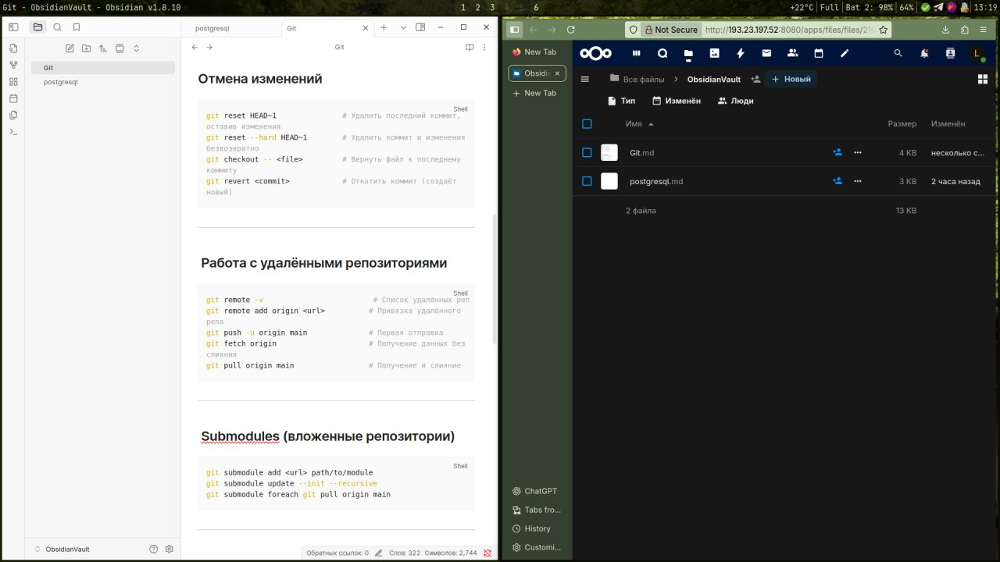

# ☁️ Obsidian Vault Sync через Nextcloud

Простая и безопасная синхронизация Obsidian-записей между компьютером, Android и iOS с помощью Nextcloud

## 📦 Что это?

Личный "облачный сервер" для заметок Obsidian, который:

- Работает на вашем сервере
- Поддерживает автоматическую синхронизацию на ПК и Android
- Работает на iOS через обходной метод

---

## 📸 Скриншоты


---

## 🛠 Что нужно?

- 🖥 Сервер с установленным Nextcloud (можно через Docker)
- 💡 Установленное приложение Obsidian на всех устройствах
- 📱 Приложение Nextcloud на Android/iOS
- (опционально) Git или Syncthing, если хочешь автоматизацию

## 🔧 Установка Nextcloud (на Arch Linux)

```sh
yay -S nextcloud
```

```sh
git clone https://github.com/luxy769/obsidian-nextcloud.git
```

```sh
cd obsidian-nextcloud
```

```sh
docker-compose up -d
```


Открой `http://your-vps-ipt:8080` и создай пользователя.

---

## 📁 Настройка структуры

1. В панели Nextcloud создай папку `ObsidianVault`
2. На ПК открой эту папку как Vault:

   ```bash
   ~/Nextcloud/ObsidianVault
   ```
3. Перенеси туда свои заметки (если были)
4. На Android укажи этот путь в Obsidian → «Открыть папку»
5. На iOS см. инструкцию ниже

---

## 📱 iOS: как синхронизировать

К сожалению, Apple не даёт Obsidian доступ к произвольным папкам. Есть 3 варианта:

### ✅ 1. Obsidian Sync (платный, просто работает)

* \$10/мес — идеальный способ синхронизации

### 🧩 2. Через Nextcloud вручную

* Установи Nextcloud на iOS
* Сделай папку `ObsidianVault` доступной офлайн
* Открывай заметки через «Файлы» → «На iPhone» → «Obsidian»

### 🛠 3. Git + Working Copy (автоматизация)

* Храни Vault в Git
* Используй [Working Copy](https://apps.apple.com/app/working-copy/id896694807)
* Свяжи с Obsidian через «Общие файлы»

---

## 🔒 Приватность и безопасность

* Данные хранятся **только у вас**
* Nextcloud поддерживает HTTPS, пароли и шифрование
* Можно использовать [Obsidian Encryption Plugin](https://github.com/obsidianmd/obsidian-encryption)

---

## 🤝 Возможности для доработки

* 📲 Автоматическая синхронизация на iOS (через Git/Syncthing)
* 🌐 Подключение через домен и HTTPS (через Nginx + Let's Encrypt)
* 🔐 Настройка резервного копирования
